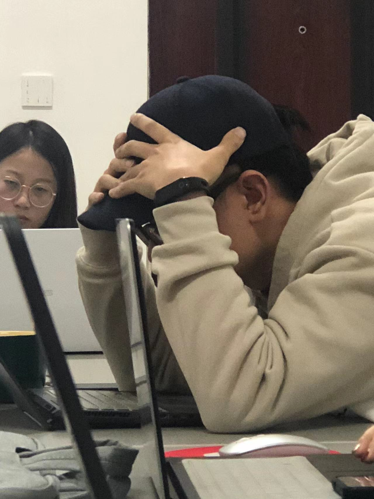

本实验室常年诚招有学术追求和想法的本科生与研究生加入我们的团队！

实验室线下地点：江西师范大学

联系邮箱： [lin.wenzheng@aliyun.com](lin.wenzheng@aliyun.com)

实验室研究领域和兴趣可参考[主页](https://home.lwz.one/#about)。

# 研究生招募
### 要求
- 地球人（正常）
- 有编程能力者优先（统计R语言及实验程序使用jspsych/初级javascript）
- 英语能力优秀者优先
- 加分项：拥有其他人类美好品质如*谦逊*、善良、乐观、勤奋、乐于助人等
- 扣分项：不遵守 dead line；把老师的话当耳旁风（待补充）
### 学习工作说明
- 实验室有一定学术追求，相对其他实验室任务会更重一些
- 研一期间学期内要求每周至少汇报一篇英文文献
- 从研一开始就进行研究工作，在老师指导下收集、分析研究数据
- 在老师、学长学姐的指导下，尽快初步掌握jspsych及心理学使用的统计原理和方法，包括但不限于GLM、MLM、basic SEM、meta analysis等
- 关于上条的补充性解释：统计部分目前老师自己有上这个课；jspsych 代码结构简单，类似inquisit，有难度部分老师可以一起研究
- 研一结束时应初步确定毕业论文题目，完成预实验及研究一的数据收集
- 研二要求拟定中……
- 研三……抓紧毕业
# 本科生招募
- 基础要求同研究生
- 本校符合条件同学推荐加入“社会、经济与管理人才班”（可能是这个名字，太长了记不住）
- 希望大家从大一大二时就参加例会和实验室研究，积累研究经历和成果
- 优先接收非毕业年级同学指导毕业论文，于大三下学期（双专业同学为大三上）之前完成数据收集
## 福利
- 基本等于没有；疫情缓和期间可能会一起吃吃喝喝
- 不是福利的福利：两周一次与武大同门举办的联合组会
- 老师目前是一个品德正直的人
- 组内人际氛围相对比较轻松
- 如果同学们能带老师申上国家级基金，就应该有劳务费等经费支持了
- 接上条，能力强的同学，待遇、称呼参照邹老师实验室标准执行 https://www.sohu.com/a/460096461_612784 
### 加入我们，让老师告别头秃！

